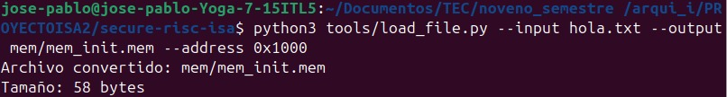
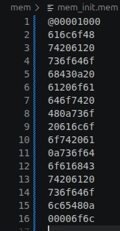

# TEA-ISA — Secure RISC Processor (23-bit)

Procesador RISC seguro de 23 bits con soporte para cifrado TEA y bóveda de llaves criptográficas, implementado en SystemVerilog y evaluado mediante simulación con Icarus Verilog.

---

## Descripción General

**TEA-ISA** es una arquitectura de set de instrucciones (ISA) tipo RISC diseñada para aplicaciones de seguridad en hardware. Sus características principales son:

- **Instrucción de 23 bits**, datos de 32 bits
- **Pipeline de 5 etapas** (IF -> ID -> EX -> MEM -> WB) con forwarding y detección de hazards
- **16 registros de propósito general** (R0–R15, 32 bits c/u)
- **Instrucciones TEA** (`TEA_ADD1`, `TEA_ADD2`) para aceleración del cifrado *Tiny Encryption Algorithm*
- **Bóveda de llaves** (Key Vault): 4 × 128 bits, accesible únicamente por instrucciones privilegiadas
- **Unidad de autenticación** con control de acceso por sesión (SIC)
- Memoria mínima de 64 KB, direccionamiento little-endian de 32 bits

---

## Dependencias

| Herramienta | Versión mínima | Instalación (Ubuntu/Debian) |
|-------------|---------------|-----------------------------|
| [Icarus Verilog](https://steveicarus.github.io/iverilog/) | 11.0 | `sudo apt install iverilog` |
| [GTKWave](http://gtkwave.sourceforge.net/) | 3.3 | `sudo apt install gtkwave` |
| Python 3 | 3.8+ | `sudo apt install python3` |
| Make | cualquiera | `sudo apt install make` |

Verificar instalación:

```bash
iverilog -V
gtkwave --version
python3 --version
```

---

## Estructura del Proyecto

```
secure-risc-isa/
├── Makefile   # Reglas de compilación y simulación
├── README.md
│
├── src/                  # Módulos SystemVerilog del procesador
│   ├── datapath.sv       # Datapath principal (top-level del pipeline)
│   ├── control_unit.sv   # Unidad de control
│   ├── alu.sv            # ALU estándar (ADD, SUB, AND, OR, XOR, shifts)
│   ├── alu_v.sv           # ALU con TEA_ADD1 / TEA_ADD2
│   ├── auth_unit.sv        # Unidad de seguridad / autenticación
│   ├── key_vault.sv         # Bóveda de llaves (4 × 128 bits)
│   ├── reg_file.sv          # Banco de registros (R0–R15)
│   ├── inst_mem.sv          # Memoria de instrucciones 
│   ├── data_memory.sv       # Memoria de datos 
│   ├── program_counter.sv   # Program Counter (32 bits)
│   ├── if_id_reg.sv         # Registro pipeline IF/ID
│   ├── id_ex_reg.sv         # Registro pipeline ID/EX
│   ├── ex_mem_reg.sv        # Registro pipeline EX/MEM
│   ├── mem_wb_reg.sv        # Registro pipeline MEM/WB
│   ├── fwd_logic.sv         # Lógica de forwarding
│   ├── hazard_detection.sv  # Detección de hazards / stalls
│   ├── branch_compare.sv    # Comparador para branches en ID
│   ├── imm_gen.sv           # Generador de inmediatos
│   ├── adder.sv             # Sumador paramétrico (PC+4, branch target)
│   ├── mux2.sv              # Multiplexor 2:1 paramétrico
│   ├── mux4.sv              # Multiplexor 4:1 paramétrico
│   └── sic_counter.sv       # Session Instruction Counter
│
├── testbenches/          # Testbenches de verificación
│   ├── datapath_tb.sv    # Testbench completo del sistema
│   ├── alu_tb.sv
│   ├── alu_v_tb.sv       # Pruebas TEA_ADD1 / TEA_ADD2
│   ├── auth_unit_tb.sv
│   ├── key_vault_tb.sv
│   ├── data_memory_tb.sv
│   ├── fwd_logic_tb.sv
│   ├── hazard_detection_tb.sv
│   └── ...                     # Un testbench por módulo
│
├── mem/                        # Archivos de memoria (.mem)
│   ├── instructions.mem        # Instrucciones del programa principal
│   ├── cifrado_test.mem        # Instrucciones para cifrado TEA
│   ├── descifrado_test.mem     # Instrucciones para descifrado TEA
│   ├── mem_init.mem            # Memoria de datos inicial 
│   └── memory_dump.mem         # Volcado de memoria post-simulación
│
├── tools/                      # Herramientas Python
│   ├── load_file.py            # Carga cualquier archivo en mem_init.mem
│   └── extract_data.py         # Extrae bytes desde un archivo .mem
│
└── docs/                       # Documentación
    ├── isa.md                  # Especificación completa del ISA
    ├── microarquitecture.md    # Descripción de la microarquitectura
    ├── simulation.md           # Guía de simulación 
    └── diagrama_microarquitectura.png
```

---

## Compilación y Ejecución

### Usando Make (recomendado)

```bash
# Preparar carpeta de salidas
make setup

# Compilar y ejecutar TODAS las simulaciones principales
make all
```

El Makefile se compone de:

- `make all` — Ejecuta todas las simulaciones principales del proyecto.
- `make setup` — Crea la carpeta `sim/` para guardar salidas.
- `make alu` — Compila y ejecuta el testbench de la ALU.
- `make memory` — Compila y ejecuta el testbench de memoria de datos.
- `make branches` — Prueba saltos condicionales y el program counter.
- `make tea` — Prueba las operaciones de cifrado TEA en `alu_v`.
- `make vault` — Prueba la bóveda de llaves y autenticación.
- `make file_crypto` — Prueba carga/extracción de datos cifrados desde memoria.
- `make datapath` — Compila y ejecuta la simulación del sistema completo.
- `make wave-alu` — Abre el `.vcd` de la ALU en GTKWave.
- `make wave-memory` — Abre el `.vcd` de memoria en GTKWave.
- `make wave-branches` — Abre el `.vcd` de branches en GTKWave.
- `make wave-tea` — Abre el `.vcd` de TEA en GTKWave.
- `make wave-vault` — Abre el `.vcd` de la bóveda en GTKWave.
- `make wave-file_crypto` — Abre el `.vcd` del cifrado con memoria en GTKWave.
- `make wave-datapath` — Abre el `.vcd` del datapath completo en GTKWave.
- `make clean` — Borra archivos generados en `sim/`.

---

### Compilación Manual con iverilog

```bash
# Compilar y simular el sistema completo
iverilog -g2012 -o dp_tb src/*.sv testbenches/datapath_tb.sv && vvp dp_tb

# Módulo específico — ejemplo: ALU
iverilog -g2012 -o alu_tb src/alu.sv testbenches/alu_tb.sv && vvp alu_tb
```

### Ver Waveforms con GTKWave

```bash
# Después de ejecutar la simulación (genera un .vcd en sim/)
gtkwave sim/datapath_tb.vcd &

# Ejemplo para la ALU
gtkwave sim/alu_tb.vcd &
```

> Los archivos `.vcd` se generan automáticamente en `sim/` al ejecutar cualquier testbench.

---

## Herramienta de Carga de Archivos

Las herramientas Python permiten cargar cualquier tipo de archivo (texto, imagen, binario, video, etc.) directamente en la memoria RAM de la simulación, y extraer los resultados después de ejecutar operaciones de cifrado o descifrado.

---

### `load_file.py` — Cargar archivo en memoria

Convierte un archivo a formato `.mem` (hex, little-endian, word-aligned) compatible con `$readmemh` de SystemVerilog.

```bash
python3 tools/load_file.py --input archivo.bin --output mem/archivo.mem --address 0x1000
```

| Parámetro | Descripción |
|-----------|-------------|
| `--input` | Ruta al archivo a cargar (cualquier formato) |
| `--output` | Archivo `.mem` de destino |
| `--address` | Dirección base en RAM (hex, ej: `0x100`, `0x1000`) |

**Ejemplos:**

Ejecución: 


Memoria: 




---

### `extract_data.py` — Extraer datos de memoria post-simulación

Lee un archivo `.mem` y extrae un bloque de bytes a partir de una dirección, reconstruyendo el archivo original o el resultado de la operación de cifrado/descifrado.

```bash
python3 tools/extract_data.py --memory mem/archivo.mem --address 0x1000 --size 64 --output datos.bin
```

| Parámetro | Descripción |
|-----------|-------------|
| `--memory` | Archivo `.mem` fuente |
| `--address` | Dirección base de lectura (hex) |
| `--size` | Número de bytes a extraer |
| `--output` | Archivo binario de salida |

**Ejemplos:**

Ejecución: 


Archivo:  


---
