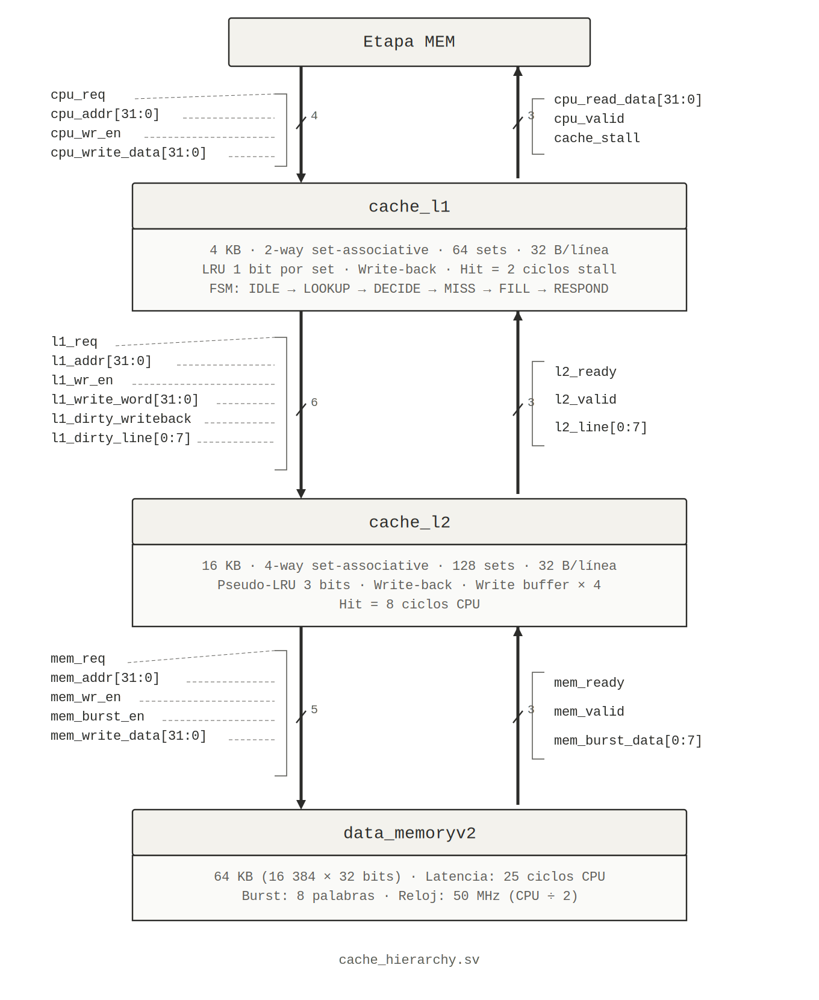

# Jerarquía de Caché L1/L2 — TEA-ISA Processor

La jerarquía de memoria del procesador TEA-ISA consta de tres niveles 
conectados en serie: Cache L1, Cache L2 y Memoria Principal. La etapa 
MEM del pipeline se comunica exclusivamente con L1, que a su vez se 
comunica con L2, y L2 con la memoria principal. La señal `cache_stall` 
congela el pipeline durante cualquier acceso que no se resuelva en el 
mismo ciclo.

El siguiente diagrama muestra los módulos, sus parámetros y las señales 
de interfaz entre cada nivel:



Las secciones siguientes documentan las decisiones de diseño tomadas 
para cada componente.

## 1. Decisión de Política de Reemplazo

### 1.1 Cache L1 — LRU exacto con 1 bit por set

Con solo 2 vías, el LRU exacto se codifica con un único bit por set sin ninguna aproximación. La regla es directa:

- `lru[s] = 0` → la vía 0 es la menos recientemente usada (candidata a desalojo).
- `lru[s] = 1` → la vía 1 es la menos recientemente usada.
- Al acceder a la vía `k`, se actualiza `lru[s] ← ~k`.

**Justificación:** El LRU exacto es óptimo para 2 vías y tiene costo de hardware mínimo (1 bit de estado, 1 operación NOT para actualizar). No hay razón para usar una aproximación cuando el caso exacto es trivial.

**Selección de víctima:**

```
if (!valid[s][0])     → desalojar vía 0  (inválida primero)
else if (!valid[s][1])→ desalojar vía 1  (inválida primero)
else                  → desalojar vía lru[s]
```

---

### 1.2 Cache L2 — Pseudo-LRU con árbol de 3 bits por set

Con 4 vías, el LRU exacto requeriría `log2(4!) ≈ 4.6` bits por set y una lógica de actualización compleja (rastrear el orden de los 4 accesos más recientes). En cambio, se usa un árbol binario de 3 bits que aproxima LRU con costo mínimo.

**Estructura del árbol `plru[s] = {b2, b1, b0}`:**

```
              b2
             /  \
           b1    b0
          /  \  /  \
        W0   W1 W2  W3

  b2 = 0 → subárbol izquierdo (W0/W1) contiene el LRU candidato
  b2 = 1 → subárbol derecho  (W2/W3) contiene el LRU candidato
  b1 desempata entre W0 y W1: b1=0 → W0 es LRU, b1=1 → W1 es LRU
  b0 desempata entre W2 y W3: b0=0 → W2 es LRU, b0=1 → W3 es LRU
```

**Selección de víctima:**

```
if (!plru[s][2]) victim = plru[s][1] ? W0 : W1
else             victim = plru[s][0] ? W2 : W3
```

**Actualización al acceder a la vía `k`:** Los bits se invierten en dirección opuesta al camino recorrido para marcar el otro subárbol como LRU:

```
Acceso W0: plru ← {1, 1, b0}   (apunta derecha y luego derecha)
Acceso W1: plru ← {1, 0, b0}   (apunta derecha y luego izquierda)
Acceso W2: plru ← {0, b1, 1}   (apunta izquierda y luego derecha)
Acceso W3: plru ← {0, b1, 0}   (apunta izquierda y luego izquierda)
```

**Justificación:** El Pseudo-LRU requiere solo 3 bits frente a ~10 bits del LRU exacto para 4 vías, y su eficiencia en la práctica es equivalente al LRU exacto (la diferencia en miss rate suele ser inferior al 1% en benchmarks reales). Esto lo hace adecuado para L2, donde el área de la lógica de control es un factor relevante.

---

## 2. Decisión de Política de Escritura y Write Buffer en L2

### 2.1 Write-Back en ambos niveles

Ambas cachés usan **write-back**: un store solo modifica la línea en la caché correspondiente, marcando el bit `dirty`. La línea modificada se propaga al nivel inferior únicamente al ser desalojada.

**Justificación:**

| Criterio | Write-Through | Write-Back |
|----------|--------------|------------|
| Tráfico al nivel inferior | Cada STORE genera tráfico | Solo las evictions dirty |
| Complejidad | Baja | Media |
| Rendimiento en write-heavy | Cuello de botella en bus | No hay saturación |
| Coherencia | Siempre actualizado abajo | Requiere flush en eviction |

Para este procesador, donde la memoria principal tiene 25 ciclos de latencia, el write-through saturaria el bus L2→RAM en cualquier programa con densidad media de stores. El write-back amortiza el costo de escritura: si una línea recibe múltiples stores antes de ser desalojada, todos se consolidan en una sola escritura a L2.

### 2.2 Write Buffer en L2 (profundidad 4)

Cuando L2 desaloja una línea dirty, necesita escribirla en RAM antes de poder instalar la nueva línea. Sin write buffer, este writeback bloquearía L1 durante los 25 ciclos que tarda la memoria principal. El write buffer desacopla ambas operaciones:

**Funcionamiento:**

1. Al detectar una víctima dirty en L2, la línea se encola en el write buffer (`wb_addr`, `wb_words`) sin esperar a que RAM confirme la escritura.
2. L2 procede inmediatamente a buscar la nueva línea en RAM (burst read).
3. El write buffer se drena hacia RAM en ciclos ociosos (`S_WB_DRAIN`), cuando L1 no tiene requests pendientes.
4. Capacidad de 4 entradas: permite acumular hasta 4 writebacks sin bloquear el pipeline de fills.

**El write buffer también acepta dirty lines de L1:** Cuando L1 evicta una línea dirty, la envía junto con su request de fill (`l1_dirty_writeback=1`, `l1_dirty_line[0:7]`). L2 la encola directamente en el write buffer en `S_IDLE`, sin estado adicional.

**Justificación de profundidad 4:** Un buffer de 1 entrada podría llenarse con un solo patrón de thrashing. Con 4 entradas se cubre el caso de thrashing simultáneo en L1 (que puede generar hasta 1 dirty eviction por request de L1) más 3 writebacks pendientes de L2 propio. Un buffer más grande aumentaría el área de forma desproporcionada para la ganancia obtenida.

---

## 3. Protocolo Completo L1 ↔ L2 ↔ RAM

Esta sección describe el flujo ciclo a ciclo para los tres escenarios principales.

### 3.1 LOAD con hit en L1 (caso común)

```
Ciclo  Pipeline MEM     L1 (estado)       L2              RAM
  0    cpu_req=1        S_IDLE→S_LOOKUP   S_IDLE          idle
  1    stall=1          S_LOOKUP→S_DECIDE S_IDLE          idle
  2    stall=1          S_DECIDE(hit)     S_IDLE          idle
       →S_RESPOND
  3    stall=0          S_RESPOND         S_IDLE          idle
       cpu_valid=1
       lee cpu_read_data
  4    pipeline avanza  S_IDLE            S_IDLE          idle
```

Costo total: **2 ciclos de stall** (LOOKUP + DECIDE).

---

### 3.2 LOAD con miss en L1, hit en L2

```
Ciclo  Pipeline MEM     L1 (estado)          L2 (estado)        RAM
  0    cpu_req=1        S_IDLE→S_LOOKUP      S_IDLE             idle
  1    stall=1          S_LOOKUP→S_DECIDE    S_IDLE             idle
  2    stall=1          S_DECIDE(miss)       S_IDLE             idle
       [L1 guarda dirty line si aplica]
       →S_MISS
  3    stall=1          S_MISS               S_IDLE(l2_ready=1) idle
       [L1 ve l2_ready=1]
       l1_req←1 (NBA)   →S_FILL
  4    stall=1          S_FILL               S_IDLE ve l1_req=1 idle
                                             →S_LOOKUP
  5    stall=1          S_FILL               S_LOOKUP→S_DECIDE  idle
  6    stall=1          S_FILL               S_DECIDE(hit)      idle
                                             →S_HIT_WAIT(7..0)
  7..13 stall=1         S_FILL               S_HIT_WAIT         idle
  14   stall=1          S_FILL               S_HIT_WAIT=0       idle
                                             →S_RESPOND_L1
  15   stall=1          S_FILL               l2_valid=1         idle
       [L1 ve l2_valid=1, instala línea]     →S_IDLE
       →S_RESPOND
  16   stall=0          S_RESPOND            S_IDLE             idle
       cpu_valid=1
  17   pipeline avanza  S_IDLE               S_IDLE             idle
```

Costo total: **≈15 ciclos de stall** (2 en L1 + ~13 en L2 incluyendo handshake).

---

### 3.3 LOAD con miss en L1, miss en L2 (acceso a RAM)

```
Ciclo  L1 (estado)    L2 (estado)         RAM (estado)
  0    S_IDLE         S_IDLE              idle
  1    S_LOOKUP       S_IDLE              idle
  2    S_DECIDE(miss) S_IDLE              idle
  3    S_MISS         S_IDLE(l2_ready)    idle
  4    S_FILL         S_LOOKUP            idle
  5    S_FILL         S_DECIDE(miss)      idle
                      [L2 encola dirty en WB si aplica]
                      →S_MEM_REQ
  6    S_FILL         S_MEM_REQ           idle
                      [mem_ready=1]
                      mem_req=1 (burst)
                      →S_MEM_WAIT
  7    S_FILL         S_MEM_WAIT          procesando
  8..31 S_FILL        S_MEM_WAIT          25 ciclos de latencia
  32   S_FILL         S_MEM_WAIT          mem_valid=1
                      →S_FILL_L2          burst_data disponible
  33   S_FILL         S_FILL_L2           idle
                      [instala línea en L2]
                      →S_RESPOND_L1
  34   S_FILL         l2_valid=1          idle
       [L1 instala línea]
       →S_RESPOND
  35   cpu_valid=1    S_IDLE              idle
  36   pipeline avanza
```

Costo total: **≈34 ciclos de stall** (2 en L1 + ~7 handshake L2 + 25 RAM).

---

### 3.4 STORE con eviction dirty en L1 y writeback a L2

Cuando L1 detecta miss y la víctima es dirty, la línea se envía a L2 simultáneamente con el fill request:

```
En S_DECIDE (L1):
  saved_victim_dirty ← 1
  l1_dirty_line[0:7] ← cur_data{victim_way}[0:7]   (línea completa)

En S_MISS (L1), cuando l2_ready=1:
  l1_req             ← 1
  l1_addr            ← latched_line_base   (dirección del NUEVO bloque)
  l1_dirty_writeback ← 1                  (indica que hay dirty line adjunta)
  l1_dirty_line      ← ya estable en el puerto de salida

En S_IDLE (L2), al ver l1_req=1:
  latch request de fill (l1_addr → nueva línea a traer)
  if (l1_dirty_writeback && !wb_full):
    wb_addr[wb_tail] ← {l1_addr[31:5], 5'b0}  ← dirección de la línea dirty
    wb_words[wb_tail] ← l1_dirty_line[0:7]
    wb_tail++; wb_count++
  → S_LOOKUP  (procesa fill normalmente)

El write buffer se drena en S_WB_DRAIN:
  cuando L2 vuelve a S_IDLE y !wb_empty && mem_ready && !l1_req:
    mem_req=1, mem_wr_en=1 (write single word hacia RAM)
    wb_head++
```

**Nota:** En la implementación actual del L2, el writeback al write buffer usa escrituras de palabra única hacia RAM (`mem_burst_en=0`), enviando la línea de 8 palabras de forma secuencial en 8 ciclos de `S_WB_DRAIN`. Esto simplifica el controlador de RAM sin requerir burst writes.

---

## 4. Análisis de Rendimiento Esperado

Con hit rates típicos para programas de propósito general:

| Escenario | Hit rate L1 | Hit rate L2 | CPI memoria |
|-----------|------------|------------|-------------|
| Sin caché | — | — | 25 ciclos/acceso |
| Solo L2 | — | 90% | 0.9×8 + 0.1×33 = 10.5 |
| L1 + L2 | 90% | 90% de misses L1 | 0.9×2 + 0.09×10 + 0.01×35 = 2.6 |

La jerarquía L1+L2 reduce el costo promedio de acceso a memoria de **25 ciclos** (sin caché) a aproximadamente **2.6 ciclos**, una mejora de ~9.6×. El impacto real depende del patrón de acceso del programa: programas con alta localidad espacial y temporal se benefician más, mientras que accesos aleatorios a datos grandes (> 4 KB) saturan L1 y degradan el beneficio al nivel de solo-L2.
