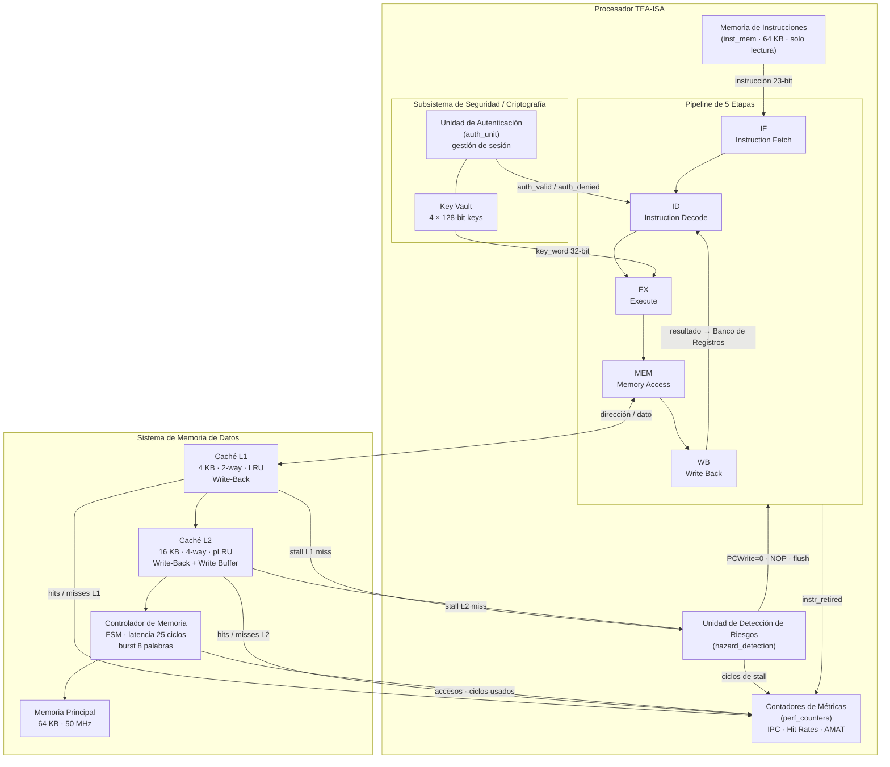
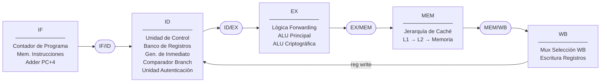
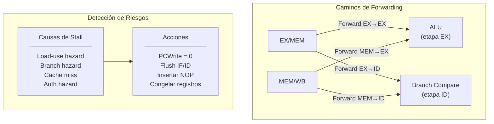
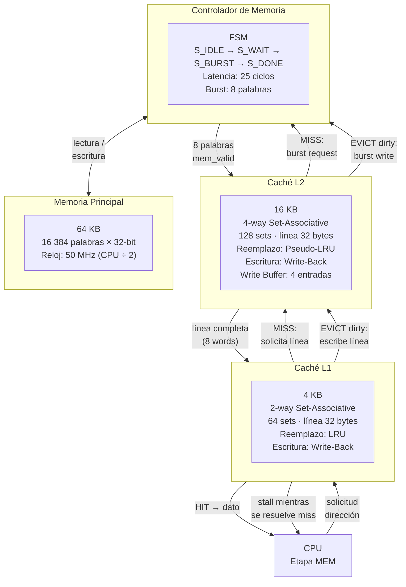
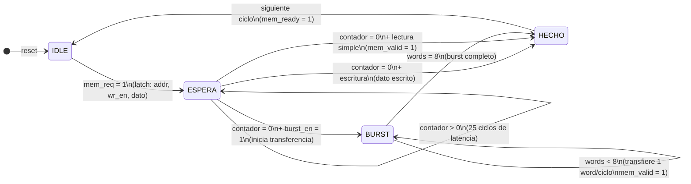
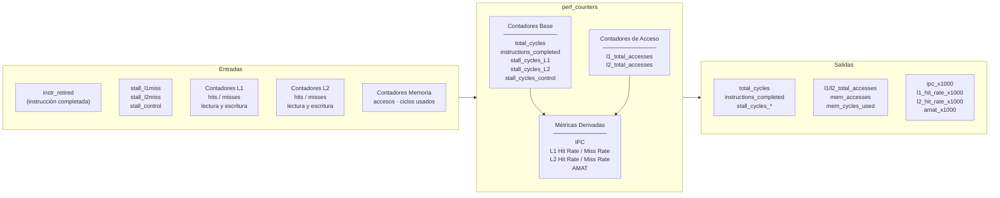
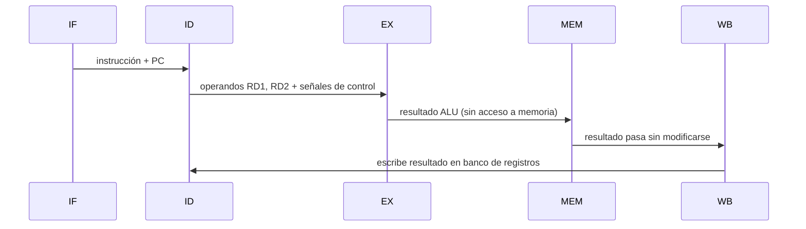
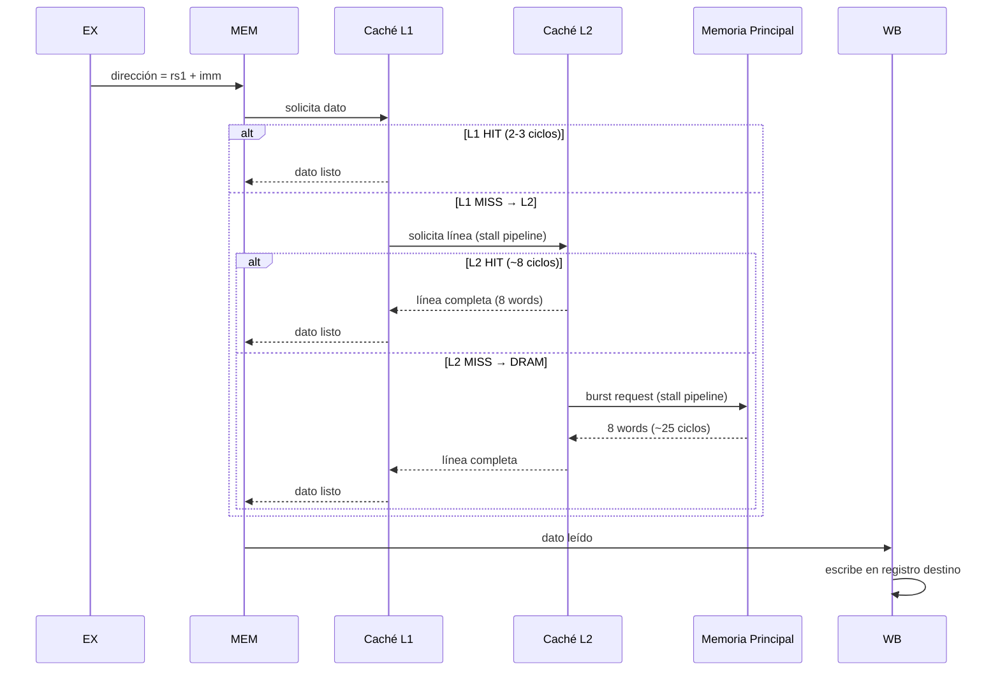

# Diagramas de Microarquitectura — Procesador TEA-ISA

---

## 1. Sistema Extendido — Vista General

---

## 2. Pipeline de 5 Etapas

### 2a. Etapas y Componentes

### 2b. Caminos de Forwarding y Detección de Riesgos

### Ciclos de Penalización por Tipo de Riesgo

| Tipo de Riesgo | Ciclos |
|---|---|
| Load-use hazard | 1 |
| Branch tomado | 1 |
| Auth hazard | 1 |
| Miss L1 → L2 hit | ~8 |
| Miss L2 → Memoria | ~25 + burst |

---

## 3. Jerarquía de Cachés

---

## 4. Controlador de Memoria — FSM

---

## 5. Contadores de Métricas

### Fórmulas

| Métrica | Fórmula |
|---|---|
| IPC | `instrucciones_completadas / ciclos_totales` |
| L1 Hit Rate | `L1_hits / L1_accesos_totales` |
| L2 Hit Rate | `L2_hits / L2_accesos_totales` |
| AMAT | `1 + MR_L1 × (8 + MR_L2 × 33)` ciclos |

> Los resultados se almacenan ×1000 para evitar punto flotante en hardware.

---

## 6. Flujo de Datos e Instrucciones

### Instrucción Aritmética (ej. ADD rd, rs1, rs2)

### Instrucción LOAD con Miss en Caché

### Resumen de Penalizaciones

| Evento | Ciclos extra |
|---|---|
| Load-use hazard | 1 ciclo |
| Branch tomado | 1 ciclo (flush IF) |
| Miss L1 → L2 hit | ~8 ciclos |
| Miss L2 → Memoria | ~25 ciclos + burst |
| Instrucción criptográfica sin sesión | Excepción (halt) |

---

## 7. Explicación del Flujo de Datos e Instrucciones

El procesador TEA-ISA implementa un pipeline clásico de cinco etapas en el que cada instrucción avanza una etapa por ciclo de reloj, de modo que en condiciones ideales pueden coexistir hasta cinco instrucciones distintas ejecutándose simultáneamente. El recorrido comienza en la etapa de Fetch, donde el Contador de Programa apunta a la memoria de instrucciones y extrae la instrucción de 23 bits correspondiente. Al mismo tiempo, un sumador calcula el valor PC+4 para que el contador pueda avanzar en el siguiente ciclo. La instrucción y el valor actual del PC se almacenan en el registro de pipeline IF/ID para que estén disponibles en la siguiente etapa.

En la etapa de Decode, la Unidad de Control interpreta el opcode y los campos de la instrucción y genera todas las señales de control que gobernarán el comportamiento del resto del pipeline. El Banco de Registros entrega los valores de los operandos fuente, mientras que el Generador de Inmediato extiende en signo el campo inmediato cuando la instrucción lo requiere. Si la instrucción es un salto condicional, el Comparador de Branch evalúa la condición en esta misma etapa, lo que permite conocer el destino del salto un ciclo antes de llegar a la etapa de ejecución y reduce la penalización a un solo ciclo. Para instrucciones criptográficas, la Unidad de Autenticación verifica que exista una sesión activa y el Key Vault entrega la palabra de clave correspondiente.

La etapa de Execute recibe los operandos y las señales de control y los procesa a través de la ALU. Antes de que los valores lleguen a la ALU, la Lógica de Forwarding comprueba si alguna instrucción posterior en el pipeline ya calculó un resultado que todavía no ha sido escrito de vuelta al Banco de Registros. Si detecta esta situación, redirige el resultado más reciente directamente hacia la entrada de la ALU, evitando así un stall innecesario. Cuando la instrucción es de tipo criptográfico, la ALU Criptográfica ejecuta la operación TEA correspondiente utilizando la clave extraída del Key Vault, y un multiplexor selecciona su resultado en lugar del de la ALU principal.

Al llegar a la etapa de Memory Access, el procesador determina si la instrucción necesita leer o escribir datos en memoria. Si no lo necesita, el resultado de la ALU simplemente atraviesa la etapa sin modificarse. Cuando sí hay un acceso a memoria, la solicitud se dirige primero a la Caché L1. Si el dato se encuentra en L1, la respuesta llega en pocos ciclos. Si hay un miss, L1 consulta a L2, que tiene una latencia de ocho ciclos cuando el dato está presente. Si tampoco se encuentra en L2, el Controlador de Memoria emite una solicitud de burst hacia la Memoria Principal, que introduce una latencia de 25 ciclos más el tiempo necesario para transferir los ocho words que componen una línea de caché. Durante todo el tiempo que el dato no está disponible, la señal cache_stall congela todos los registros del pipeline y el Contador de Programa, impidiendo que nuevas instrucciones avancen hasta que la memoria responda.

Finalmente, en la etapa de Write Back, un multiplexor selecciona el valor que se escribirá en el Banco de Registros: puede ser el resultado de la ALU, el dato leído de memoria, o el valor PC+4 en el caso de instrucciones de salto con enlace que deben guardar la dirección de retorno. La escritura ocurre en el flanco negativo del reloj, de forma que no interfiere con la lectura que realiza la etapa de Decode en el flanco positivo del mismo ciclo, eliminando así el riesgo de escritura y lectura simultánea sin necesidad de un stall adicional.

El módulo de Contadores de Métricas observa de forma pasiva todas estas actividades. Cuenta cada ciclo que transcurre, cada instrucción que completa su recorrido por el pipeline, y cada ciclo en que el procesador estuvo detenido por un miss de caché o por un riesgo de control. Con esos datos calcula métricas como el IPC, las tasas de acierto de L1 y L2, y el Tiempo Promedio de Acceso a Memoria, que permiten evaluar el rendimiento real del sistema bajo distintas cargas de trabajo.
