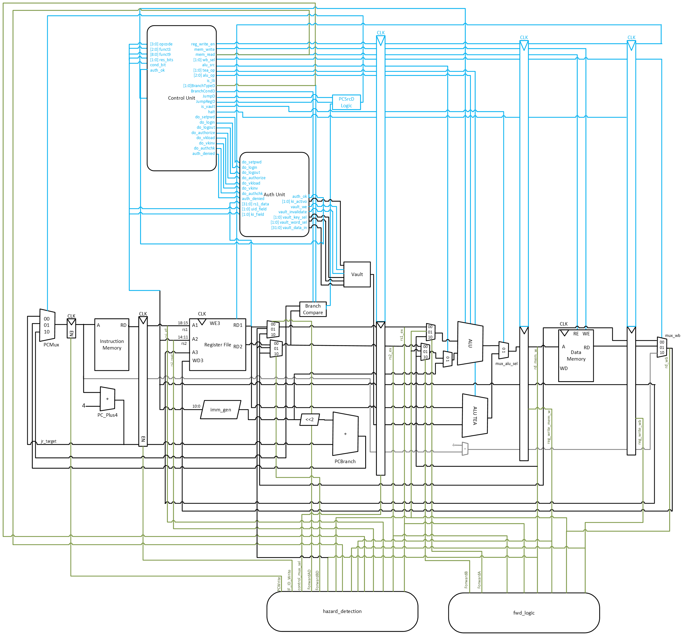

# Microarquitectura e Implementación del Procesador Secure RISC ISA

- **Integrantes:** 
Ana Melissa Vásquez Rojas, 
Jose Pablo Fernandez Rojas,  
Dario Garro Moya, 
Isaac Somarribas Montero
- **Curso:** CE-4301 Arquitectura de Computadores I
- **Proyecto:** Arquitectura del Set de Instrucciones (ISA) Específica tipo RISC para Aplicaciones de Seguridad Informática
- **Profesor:** Dr. Ing. Jeferson González Gómez

---

## Tabla de contenidos

1. [Objetivo del documento](#1-objetivo-del-documento)
2. [Diagrama general de la microarquitectura](#2-diagrama-general-de-la-microarquitectura)
3. [Organización segmentada del procesador](#3-organización-segmentada-del-procesador)
4. [Descripción de los módulos SystemVerilog implementados](#4-descripción-de-los-módulos-systemverilog-implementados)
5. [Flujo interno de datos e instrucciones](#5-flujo-interno-de-datos-e-instrucciones)
6. [Manejo de riesgos del pipeline](#6-manejo-de-riesgos-del-pipeline)
7. [Subsistema de seguridad y aceleración criptográfica](#7-subsistema-de-seguridad-y-aceleración-criptográfica)
8. [Estado de registros, memoria y bóveda durante la ejecución](#8-estado-de-registros-memoria-y-bóveda-durante-la-ejecución)

---

## 1. Objetivo del documento
 
El presente documento tiene como objetivo describir la microarquitectura utilizada para la implementación del procesador TEA-ISA, una arquitectura RISC de 23 bits.
 
Se describe la organización pipeline de 5 etapas, los módulos que la componen, el flujo de datos e instrucciones a través de cada etapa, los mecanismos de detección y resolución de riesgos, y el subsistema criptográfico de seguridad basado en bóveda de llaves TEA.
 
---
 
## 2. Diagrama de bloques de la microarquitectura
 

 
El diagrama muestra los bloques principales del procesador y sus interconexiones:
 
- **Program Counter (PC)** y lógica de selección del próximo PC (  mux4  )
- **Memoria de instrucciones** (  inst_mem  )
- **Registro de pipeline IF/ID**
- **Banco de registros** (  reg_file  ) y **generador de inmediatos** (  imm_gen  )
- **Unidad de control** (control_unit  )
- **Unidad de autenticación** (  auth_unit  ) y **bóveda de llaves** (  key_vault  )
- **Unidad de detección de riesgos** (  hazard_detection  ) y **lógica de forwarding** (fwd_logic)
- **Registro de pipeline ID/EX**
- **ALU principal** (  alu  ) y **ALU criptográfica** (  alu_v  )
- **Registro de pipeline EX/MEM**
- **Memoria de datos** (  data_memory  )
- **Registro de pipeline MEM/WB**
- **Multiplexor de write-back**

Las señales de control fluyen hacia adelante desde la Unidad de Control (etapa ID) propagándose a través de los registros de pipeline hasta las etapas que las consumen. Los datos de resultado pueden ser reenviados hacia atrás por la lógica de forwarding.
 
---
 
## 3. Organización segmentada del procesador
 
El procesador implementa un pipeline de **5 etapas**:
 
- **IF — Instruction Fetch:** obtiene la instrucción de 23 bits desde   inst_mem   usando el PC actual. El PC puede tomar tres valores: PC+4 para ejecución secuencial, la dirección objetivo calculada para saltos JAL y saltos tomados, o el contenido de un registro fuente para la instrucción JR.
- **ID — Instruction Decode:** decodifica los campos de la instrucción, lee el banco de registros, genera el inmediato, evalúa la condición de rama (  branch_compare  ), ejecuta instrucciones de seguridad/vault (  auth_unit  ) y determina las señales de control (control_unit  ).
- **EX — Execute:** realiza la operación aritmético-lógica en la ALU principal, o la operación criptográfica TEA en la   alu_v. Los operandos pueden provenir del registro de pipeline ID/EX o de forwarding.
- **MEM — Memory Access:** accede a la memoria de datos (  data_memory  ) para instrucciones   LOAD   y   STORE. Para otras instrucciones, el resultado de la ALU simplemente pasa al registro MEM/WB.
- **WB — Write Back:** selecciona el resultado final (ALU/TEA, dato de memoria, o PC+4 para JAL) mediante un   mux4   y lo escribe en el banco de registros.

Los registros de pipeline (  if_id_reg,   id_ex_reg,   ex_mem_reg,   mem_wb_reg  ) separan cada etapa y permiten la ejecución simultánea de hasta 5 instrucciones en distintas fases de procesamiento.

---
 
## 4. Descripción de los módulos SystemVerilog implementados
 
### 4.1  ` datapath ` 
 
Módulo que instancia e interconecta todos los demás módulos. Contiene la lógica de selección del PC (  mux4,   adder  ), el flujo de señales de control propagadas por los registros de pipeline, y forwarding. Es el módulo principal del procesador.
 

### 4.2  ` program_counter ` 
 
Registro de 32 bits que almacena el valor actual del PC. Solo actualiza su valor cuando la señal   PCWrite   está activa (habilitada por la unidad de detección de riesgos) y el procesador no ha ejecutado   HALT.
 
**Puertos relevantes:**   clk,   rst,   PCWrite,   pc_next   (entrada),   pc_out   (salida)
 
### 4.3  ` inst_mem ` 

Memoria de instrucciones de solo lectura con capacidad para 16 384 slots de 23 bits, cubriendo un espacio de 64 KB direccionado por bytes. El acceso es combinacional, dado el PC, entrega inmediatamente la instrucción correspondiente usando   addr[31:2]   como índice (acceso word-aligned). Se inicializa en simulación mediante   $readmemh   con el archivo   mem/instructions.mem, que contiene el programa ensamblado en formato hexadecimal de 6 dígitos.

**Puertos relevantes:**   addr   (32 bits),   inst   (23 bits)
 
### 4.4  ` if_id_reg ` 

Registro de pipeline entre las etapas IF e ID. En cada flanco de subida del reloj captura la instrucción de 23 bits (  in_instr  ) y el PC actual (  in_pc  ), y los mantiene disponibles para la etapa ID durante el ciclo siguiente. Cuando   rst   o   flush   están activos, ambos campos se ponen a cero; esto ocurre tras un salto o rama tomada para descartar la instrucción que entró en IF. Cuando   en=0   (stall), el registro congela su contenido y no captura nuevos valores, manteniendo la instrucción en ID hasta que el riesgo se resuelva.

**Campos almacenados:**   instr[22:0],   pc[31:0]  

### 4.5  ` imm_gen ` 
 
Generador de inmediatos. A partir del opcode examina los bits relevantes de la instrucción y produce un valor de 32 bits extendido listo para usar en la ALU o en el cálculo de direcciones. Para instrucciones de tipo I (ADDI, LOAD, STORE) extiende con signo los 11 bits   instr[10:0]. Para saltos condicionales BEQ/BNE y BGE/BGT extiende con signo 10 bits (  instr[9:0]  ), omitiendo el bit 10 que en esas instrucciones codifica la condición. Para JAL extiende con signo los 15 bits   instr[14:0]. El caso especial es LLI: en lugar de extender con signo, el módulo toma los 8 bits bajos   instr[7:0]   y los desplaza a la posición de byte indicada por   byte_sel   (  instr[10:9]  ).

**Puertos relevantes:**   instruction   (23 bits),   imm_out   (32 bits),   byte_sel   (2 bits)
**Tipos de inmediato soportados:**
 
| Tipo | Bits del inmediato | Extensión |
|------|--------------------|-----------|
| I, S, B |   instr[10:0]   | Signo (11 bits) |
| J, JR |   instr[14:0]   | Signo (15 bits) |
| LLI |   instr[7:0]   | Cero (8 bits efectivos) |
 
### 4.6  ` reg_file ` 

Banco de 16 registros de propósito general de 32 bits (R0–R15). Las dos lecturas (  RD1,   RD2  ) son combinacionales: el valor aparece en la salida de forma inmediata según los índices   rs1   y   rs2, con R0 cableado a cero. La escritura ocurre en flanco de bajada (  negedge clk  ): cuando   write_en=1   y   rd≠0, el valor   WD3   se almacena en el registro destino. 

**Puertos relevantes:**   rs1,   rs2,   rd   (índices de 4 bits),   WD3   (dato a escribir),   RD1,   RD2   (datos leídos),   write_en  
 
### 4.7  ` control_unit ` 
 
Unidad de control combinacional. Recibe el opcode,   funct3,   funct9, el bit de condición y el estado de autenticación (  auth_ok  ). Genera todas las señales de control para el datapath y la unidad de seguridad   auth_unit  :
 
-   reg_write_en,   mem_write,   mem_read,   alu_src,   wb_sel[1:0],   alu_op[2:0]  
-   BranchTypeD,   BranchCondD,   JumpD,   JumpRegD,   halt  
-   is_vault,   is_lli,   tea_op[1:0]  
-   do_login,   do_logout,   do_setpwd,   do_authorize,   do_vkload,   do_vkinv,   do_authchk,   auth_denied  
Cuando una instrucción privilegiada (TEA, VKLOAD, VKINV) se ejecuta con   AUTH=0, la unidad de control activa   auth_denied   en lugar de las señales de operación normales.
 
### 4.8  ` branch_compare ` 
 
Módulo combinacional ubicado en la etapa ID que evalúa la condición de rama usando los operandos ya resueltos con forwarding (  BrA,   BrB  ). Produce   TakenD=1   si la rama debe tomarse, lo que permite calcular el PC de destino dentro de la misma etapa ID y vaciar solo 1 ciclo del pipeline (la instrucción en IF).
 
**Condiciones:** BEQ, BNE, BGE, BGT (seleccionadas por   BranchTypeD   y   BranchCondD  )
 
### 4.9  ` id_ex_reg ` 

Registro de pipeline entre las etapas ID y EX. En cada flanco de subida captura y propaga señales de **control** (  reg_write,   mem_write,   mem_read,   alu_src,   alu_op,   wb_sel,   is_lli,   byte_sel,   is_vault,   tea_op  ) y las de **datos** (  src_a,   src_b,   imm,   pc,   rd,   rs1,   rs2,   key_word  ). La palabra de llave   key_word, leída del   key_vault   en ID, viaja junto al resto de operandos para estar disponible en la   alu_v   durante EX. Cuando   nop=1   (stall por riesgo) o   rst, todas las salidas se ponen a cero. Cuando   en=0, el registro congela su contenido.

### 4.10  ` alu `  
 
ALU principal de 32 bits. Implementa las operaciones: ADD, SUB, AND, OR, XOR, SLL, SRL, SRA. El campo   funct[2:0]   selecciona la operación. También implementa la lógica especial de   LLI  : cuando   is_lli=1   y se recibe un operando B con el byte deseado, inserta el byte en la posición indicada por   byte_sel   dentro del valor actual del registro destino.
 
 
### 4.11  ` alu_v ` 
 
ALU criptográfica para instrucciones TEA. Recibe el operando   rs1   y la palabra de llave   K   (proveniente del   key_vault   a través del registro ID/EX). Implementa:
 
-   TEA_ADD1   (  tea_op=01  ):   result = (rs1 << 4) + K  
-   TEA_ADD2   (  tea_op=10  ):   result = (rs1 >> 5) + K  
El resultado de   alu_v   se selecciona como resultado final de EX mediante un   mux2   controlado por   is_vault.

 
### 4.12 `fwd_logic`

Unidad de forwarding para la etapa EX. Genera las señales `ForwardA` y `ForwardB` (2 bits cada una) que controlan los mux4 de selección de operandos en EX. Compara los registros fuente de la instrucción en EX contra los registros destino de instrucciones en MEM y WB, activando el forwarding con prioridad EX/MEM > MEM/WB. R0 nunca recibe forwarding.
El forwarding desde EX/MEM se bloquea cuando la instrucción en esa etapa es un LOAD (`EX_MEM_MemtoReg=1`). Los casos donde el forwarding no es suficiente son manejados por `hazard_detection` mediante stalls.

### 4.13 `hazard_detection`

Unidad de detección de riesgos. Monitorea los registros fuente de la instrucción en ID contra los registros destino de instrucciones en EX, MEM y WB. Cuando detecta un riesgo que el forwarding no puede resolver, congela el PC (`PCWrite=0`), congela el registro IF/ID (`IF_ID_Write=0`)
e inserta un stall en ID/EX (`control_mux_sel=1`). También genera `ForwardAD` y `ForwardBD` para el forwarding en etapa ID requerido por saltos condicionales y JR. La lógica detallada de cada caso se describe en la
sección 6.

 
### 4.14  ` ex_mem_reg ` 

Registro de pipeline entre las etapas EX y MEM. En cada flanco de subida captura el resultado de la ALU o ALU_V (  alu_result  ), el dato a escribir en memoria en caso de STORE (  write_data  ), el valor   pc_plus4   para instrucciones JAL, y el índice del registro destino   rd. También propaga las señales de control que aún son necesarias en etapas posteriores:   mem_write,   mem_read,   reg_write   y   wb_sel. En reset, todos los campos se ponen a cero. Cuando   en=0, el registro congela su contenido.

### 4.15  ` data_memory  `

Memoria de datos de 64 KB organizada como 16 384 palabras de 32 bits, direccionada por bytes. La lectura es asíncrona: cuando   mem_read=1, el dato aparece combinacionalmente en   read_data   usando   addr[15:2]   como índice de palabra. La escritura es síncrona en flanco de subida: cuando   mem_write=1, el dato se almacena en el ciclo siguiente. En ambos casos, si los bits   addr[1:0]   no son   00   (acceso no alineado), se activa   align_fault   y la operación no se ejecuta. Puede precargarse desde   mem/mem_init.mem   mediante   $readmemh.

### 4.16  ` mem_wb_reg  `

Registro de pipeline entre las etapas MEM y WB. En cada flanco de subida captura el dato leído de memoria (  read_data  ), el resultado de la ALU (  alu_result  ), el valor   pc_plus4   para instrucciones JAL, el índice del registro destino   rd, y las señales de control   reg_write   y   wb_sel   que determinan si se escribe en el banco de registros y qué dato se selecciona. En reset, todos los campos se ponen a cero. Cuando   en=0, el registro congela su contenido.

 
### 4.17  ` auth_unit  `

Módulo de seguridad y autenticación ubicado en la etapa ID. Mantiene estado interno de sesión (tabla de contraseñas, tokens de fábrica, flags   prov_mode,   pwd_set, Session Instruction Counter). Recibe comandos decodificados por la control_unit   y ejecuta:

- **AUTHORIZE:** verifica token y activa   prov_mode[uid].
- **SETPWD:** registra contraseña en   pwd_table[uid], activa   AUTH=1   y establece   ki_activo.
- **LOGIN:** valida contraseña, activa   AUTH=1   y reinicia el SIC.
- **LOGOUT:** limpia   AUTH,   VF,   SEC_EXC   y   SEC_CAUSE. Siempre ejecuta independientemente del estado de autenticación.
- **VKLOAD:** genera señales de escritura hacia   key_vault.
- **VKINV:** genera señal de invalidación hacia   key_vault.
- **AUTHCHK:** copia   AUTH   a   VF   en el Status Register.
- **SIC:** incrementa por cada instrucción retirada con   AUTH=1  ; al alcanzar el límite de sesión, ejecuta LOGOUT automático.

Expone   auth_ok   hacia la control_unit   para el control de acceso de instrucciones privilegiadas.

### 4.18  ` key_vault  `

Módulo de almacenamiento seguro de 4 llaves de 128 bits, organizadas internamente como un arreglo de 4×4 palabras de 32 bits (  vault[key][word]  ). La escritura es síncrona y solo puede ocurrir mediante señales generadas por la   auth_unit  :   vault_we   escribe una palabra individual en la posición indicada por   vault_key_sel   y   vault_word_sel, mientras que   vault_invalidate   pone a cero las 4 palabras de la llave seleccionada. La lectura es combinacional: la palabra activa se obtiene directamente como   vault[ki_activo][ki]   y se entrega en   key_word_out   hacia el registro ID/EX para uso de las instrucciones TEA. En reset, todas las palabras se inicializan a cero.
 
### 4.19  ` sic_counter ` 

Contador de instrucciones de sesión (Session Instruction Counter). Implementa un contador con límite en  SESSION_LIMIT. Se incrementa en cada ciclo en que   enable=1   (instrucción retirada con   AUTH=1  ) y deja de contar una vez que  expired=1  para evitar desbordamiento. La señal   clear   lo reinicia a cero, activada por la   auth_unit   en cada LOGIN o SETPWD exitoso. Cuando   expired   se activa, la   auth_unit   ejecuta el logout automático de sesión. Está instanciado dentro de   auth_unit.

---
 
## 5. Flujo interno de datos e instrucciones
 
### 5.1 Instrucción R-Type (ej.   add r4, r5, r6  )
 
1. **IF:** El PC selecciona la instrucción desde   inst_mem. La instrucción de 23 bits pasa al registro IF/ID junto con el PC actual. PC se actualiza a PC+4.
2. **ID:** El opcode   1100   indica R-type. La control_unit   activa   reg_write_en=1,   alu_src=0, y establece   alu_op   según   funct3. El banco de registros entrega  src_a (R5) y  src_b (R6). El ID/EX propaga operandos, señales de control y el índice   rd=4.
3. **EX:** La fwd_logic determina si los operandos necesitan forwarding. La ALU suma R5 y R6. El resultado pasa al registro EX/MEM.
4. **MEM:** No hay acceso a memoria (mem_read=0,   mem_write=0). El resultado ALU pasa directamente al registro MEM/WB.
5. **WB:** El   mux4   de write-back selecciona   wb_sel=00   (resultado ALU). El banco de registros escribe en R4.
### 5.2 Instrucción LOAD (ej.   load r3, 8(r2)  )
 
1. **IF->ID:** Igual que R-type. control_unit   activa   mem_read=1,   wb_sel=01,   alu_src=1.
2. **EX:** La ALU calcula la dirección efectiva:   R2 + sign_ext(8).
3. **MEM:** La  data_memory  lee la palabra en esa dirección y la entrega como read_data.
4. **WB:** El  mux4  selecciona  wb_sel=01  (dato de memoria). Se escribe en R3.
### 5.3 Instrucción JAL (ej.   jal r1, offset  )
 
1. **IF->ID:** control_unit   activa   JumpD=1,   reg_write_en=1,   wb_sel=10. El PC de destino se calcula en ID como  PC_ID + (imm << 2). El pipeline vacía la instrucción en IF.
2. **EX:** Se calcula  PC_EX + 4  para guardar la dirección de retorno.
3. **WB:** El   mux4   selecciona  wb_sel=10   (PC+4). Se escribe en R1.
### 5.4 Instrucción TEA_ADD1 (ej.   tea_add1 r4, r5, k0  )
 
1. **IF->ID:** control_unit   verifica   auth_ok. Si   AUTH=1, activa   is_vault=1,   tea_op=01,   reg_write_en=1. El   key_vault   entrega la palabra  K[0]  de la llave activa. El ID/EX propaga  key_word  junto con  src_a  (R5).
2. **EX:** La  alu_v  calcula   (R5 << 4) + K[0]. El   mux2   de selección final elige   vault_result_ex   por   is_vault=1.
3. **MEM->WB:** El resultado pasa sin acceso a memoria. Se escribe en R4.
Si   AUTH=0, la control_unit   activa   auth_denied=1, la   auth_unit   registra la excepción de seguridad (  SEC_EXC=1,   SEC_CAUSE=001  ) y la instrucción se convierte en NOP. El PC avanza normalmente.
 
---
 
## 6. Manejo de riesgos del pipeline

El procesador implementa dos mecanismos: **forwarding**
para los casos en que el dato ya está disponible como señal combinacional,
y **stalls** cuando no lo está.

### 6.1 Forwarding en etapa EX (`fwd_logic`)

La unidad `fwd_logic` opera en EX y resuelve dependencias RAW cuando el
resultado de una instrucción anterior ya fue calculado pero aún no escrito
en el banco de registros. Genera `ForwardA` y `ForwardB` (2 bits) que
controlan muxes de selección de operandos:

| Valor | Fuente del operando |
|-------|-------------------|
| `2'b00` | Banco de registros (sin hazard) |
| `2'b10` | Resultado ALU desde etapa MEM |
| `2'b01` | Resultado desde etapa WB |

La prioridad es EX/MEM > MEM/WB. R0 nunca recibe forwarding. El
forwarding desde EX/MEM se bloquea si la instrucción en esa etapa es un
LOAD (`EX_MEM_MemtoReg=1`), porque el dato de memoria aún no existe.

### 6.2 Forwarding en etapa ID

Las ramas y JR se resuelven en ID, un ciclo antes que las instrucciones
ALU. La `hazard_detection` genera `ForwardAD` y `ForwardBD` con la misma
codificación para los muxes en ID:

- Instrucción que genera el dato en MEM (ALU): `ForwardAD=10`, sin stall.
- Instrucción que genera el dato en WB (wire `result_wb`): `ForwardAD=01`, sin stall.
  Posible porque `result_wb` ya tiene el valor correcto antes del
  negedge de escritura.

### 6.3 Stalls

Cuando el forwarding no alcanza, la `hazard_detection` activa
`PCWrite=0`, `IF_ID_Write=0` y `control_mux_sel=1`, congelando PC e
IF/ID e insertando una burbuja en ID/EX. Hay tres casos:

**Load-use stall:** la instrucción en EX es un LOAD y su `rd` coincide
con un operando de la instrucción en ID. El dato de memoria no existe
hasta el final de MEM, por lo que no puede ser forwarded a EX. Se aplica
1 ciclo de stall.

load r4, 0(r2)   ; dato disponible al final de MEM
add  r7, r4, r5  ; necesita r4 al inicio de EX → STALL 1 ciclo

**Branch/JR stall:** si la instrucción que genera el dato de una rama
o JR está en EX, o en MEM como LOAD, el forwarding en ID no tiene el
dato disponible. Se aplica 1 ciclo de stall. Si está en MEM como ALU
o en WB, el forwarding ID resuelve sin stall.

**Auth stall:** `LOGIN`, `SETPWD`, `AUTHORIZE` y `VKLOAD` leen el
banco de registros en `posedge clk`, sin path de forwarding.
La escritura ocurre en `negedge clk` de WB, después de esa lectura.
Por eso el auth stall se aplica incluso cuando la instrucción que
genera el dato está en WB, a diferencia del forwarding de ramas.

### 6.4 Hazards de control

Los saltos condiciones y JAL se detectan en ID. Cuando la condición es
verdadera o se decodifica un JAL, el pipeline vacía la instrucción que
entró en IF (`flush=1`) introduciendo 1 ciclo de penalización. No se
implementa predicción de saltos.
 
## 7. Subsistema de seguridad y aceleración criptográfica
 
### 7.1 Status Register (SR)
 
El procesador mantiene un registro de estado de 32 bits con los siguientes bits relevantes para la seguridad:
 
| Bit(s) | Nombre | Descripción |
|--------|--------|-------------|
|   SR[0]   | AUTH   | Sesión autenticada activa |
|   SR[1]   |   VF   | Flag de consulta visible (resultado de AUTHCHK) |
|   SR[2]   |   SEC_EXC   | Excepción de seguridad activa |
|   SR[5:3]   |   SEC_CAUSE   | Código de causa de excepción |
|   SR[31:6]   | — | Reservado |
 
### 7.2 Flujo de autenticación
 
El ciclo de vida de una sesión autenticada es el siguiente:
 
      
AUTHORIZE (rs2=uid, rs1=token)
    -> prov_mode[uid] = 1 (si token correcto)
SETPWD (rs2=uid, rs1=pwd)   [first boot, requiere prov_mode=1]
    -> pwd_table[uid] = pwd
    -> AUTH=1, ki_activo=uid, SIC=0
...instrucciones privilegiadas...
LOGOUT
    -> AUTH=0, VF=0, SEC_EXC=0
      
 
En sesiones posteriores: LOGIN (rs2=uid, rs1=pwd) valida contra pwd_table y activa AUTH=1.
 
### 7.3 Session Instruction Counter (SIC)
 
El SIC se reinicia a cero en cada autenticación exitosa y se incrementa con cada instrucción retirada mientras   AUTH=1. Al alcanzar   SESSION_LIMIT, la   auth_unit   ejecuta un LOGOUT automático, revocando todos los privilegios de la sesión. Esto limita la ventana de tiempo disponible para operaciones privilegiadas.
 
### 7.4 Bóveda de llaves y rutas internas
 
Las cuatro llaves de 128 bits residen exclusivamente dentro del módulo key_vault. El acceso de escritura solo puede ocurrir mediante instrucciones  VKLOAD  (validadas por  auth_unit). La lectura de la palabra activa es una ruta interna que va directamente al registro ID/EX y no pasa por el banco de registros general ni por la memoria de datos.
 
Una llave completa se carga en 4 instrucciones  VKLOAD consecutivas con ki=0..3. Se recomienda limpiar el registro temporal entre cada carga (add r_temp, r0, r0 ).
 
### 7.5 Excepciones de seguridad
 
Cuando ocurre una violación de seguridad, la  auth_unit  activa  SR[SEC_EXC]=1  y registra la causa en  SR[SEC_CAUSE]. La instrucción infractora es anulada (tratada como NOP) y el PC continúa secuencialmente. El procesador no interrumpe ni redirige el flujo de control por excepciones de seguridad; la detección y recuperación quedan a cargo del software.
 
| Código | Causa |
|--------|-------|
|   001   | Instrucción privilegiada con   AUTH=0   |
|   010   | Contraseña incorrecta en   LOGIN   |
|   011   | Token incorrecto en   AUTHORIZE   |
|   100   | SETPWD   sin   prov_mode=1   activo |
 
---
 
## 8. Estado de registros, memoria y bóveda durante la ejecución
 
Durante la ejecución de un programa típico de cifrado TEA, el estado del procesador evoluciona de la siguiente forma:

 
1. **Inicialización:** Los registros R0–R15 arrancan con sus valores de inicialización (R0=0 siempre). La memoria de datos contiene los bloques a cifrar. La bóveda está vacía o contiene llaves de sesiones anteriores.
2. **Fase de autenticación:** Se ejecutan AUTHORIZE, SETPWD / LOGIN. El SR queda con AUTH=1. El SIC se reinicia a 0.
3. **Carga de llave:** Cuatro instrucciones VKLOAD  escriben las 4 palabras de 32 bits de la llave TEA en la bóveda.
4. **Cifrado:** Las instrucciones TEA_ADD1 y TEA_ADD2 operan sobre los datos en registros, accediendo a las palabras de llave por la ruta interna. Los resultados intermedios y finales viven en registros de propósito general.
5. **Escritura de resultados:** Instrucciones STORE guardan los bloques cifrados en memoria de datos.
6. **Cierre de sesión:** LOGOUT o expiración del SIC limpian AUTH. La bóveda mantiene sus valores hasta una invalidación con VKINV.
7. **Terminación:** La instrucción HALT congela el pipeline y detiene la ejecución. El banco de registros y la memoria retienen su estado final.

---