# 3. Análisis de rendimiento y validación

## 3.1 Metodología de medición

En este análisis se compara el comportamiento del procesador en dos configuraciones:

1. __Con caché:__ datapathv3, jerarquía L1/L2 y memoria principal realista.
2. __Sin caché:__ datapath legacy original, acceso directo a la memoria de datos.

Para cada configuración se ejecutaron los mismos 4 benchmarks ensamblados a .mem y se obtuvieron las métricas para cada corrida usando CSV:

- Con caché: sim/caché_timeline_benchmark_*.csv
- Sin caché: sim/nocaché_timeline_benchmark_*.csv

Las métricas utilizadas para el análisis fueron:

- Total cycles (perf_cycles)
- Instructions retired (perf_instr)
- IPC (ipc_x1000)
- Accesos de memoria / accesos de datos
- Stalls observados
- Hit/miss rates y AMAT (solo en las pruebas del procesador con caché)

Para el análisis se generaron herramientas como:
- Tablas resumen por benchmark (con y sin caché).
- Tabla y gráficas comparativas caché vs no-caché.

## 3.2 Benchmarks utilizados

Se utilizaron los siguientes programas de prueba en ensamblador:

1. Benchmark 1 - Sequential
2. Benchmark 2 - Stride
3. Benchmark 3 - Random
4. Benchmark 4 - Thousands

Objetivo de cada patron:

- Sequential: medir localidad espacial/temporal con accesos contiguos.
- Stride: forzar patrones de acceso menos amigables para caché.
- Random: evaluar comportamiento ante dispersion de direcciones.
- Thousands: estresar ejecucion larga con alto volumen de accesos.

## 3.3 Resultados por benchmark (con y sin caché)

## 3.3.1 Benchmark 1 - Sequential

Resultados relevantes:

- Con caché: 1048 ciclos, IPC 0.309, 64 accesos totales en L1, 8 accesos a RAM, L1 hit rate 87.5%, AMAT 6.125 ciclos.
- Sin caché: 519 ciclos, IPC 0.624, 64 accesos de memoria.

El patrón secuencial en L1 tiene un alto porcentaje en hits de 87.5%. Sin embargo, para esta prueba, la configuración con caché es más lenta en ciclos totales que la sin caché. La causa principal es que esta ruta con caché está conectada a la memoria principal realista que tiene alta latencia, y por esto cada miss penaliza fuertemente el tiempo total.

**Tabla resumen (con caché)**

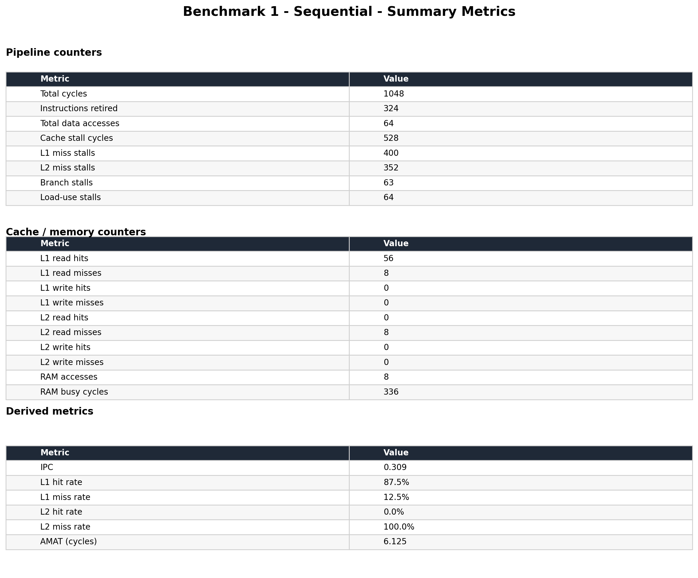

**Hit rate vs time (con caché)**

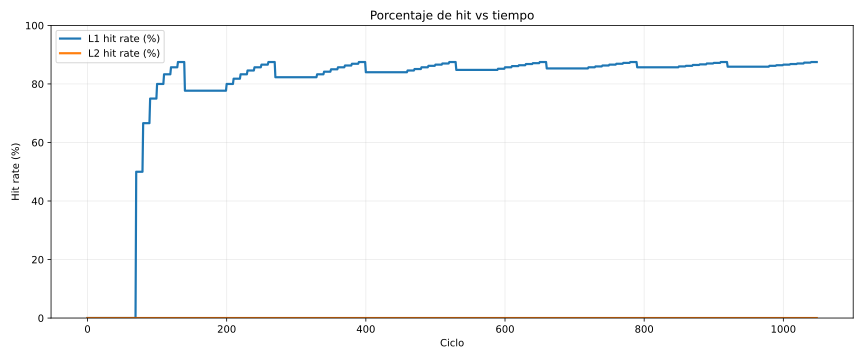

**Tabla resumen (sin caché)**

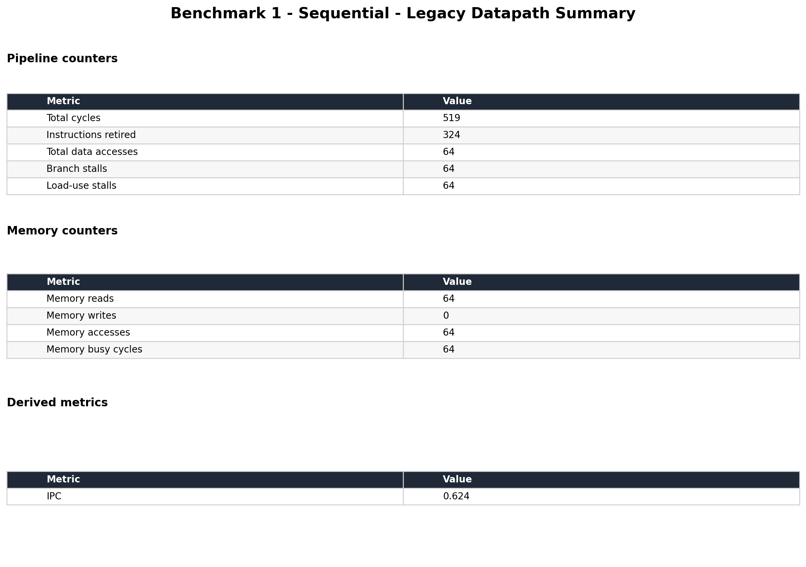

## 3.3.2 Benchmark 2 - Stride

Resultados relevantes:

- Con caché: 16514 ciclos, IPC 0.121, 400 accesos en L1, 250 accesos a RAM, L1 hit rate 37.5%, AMAT 26.625 ciclos.
- Sin caché: 3212 ciclos, IPC 0.625, 400 accesos de memoria.

- Este benchmark muestra gran cantidad de misses en L1, es decir baja la efectividad de caché.
- AMAT sube de forma importante y domina el costo total de ejecución.
- Es el caso donde la diferencia de ciclos entre ambas configuraciones es más marcada.

**Tabla resumen (con caché)**

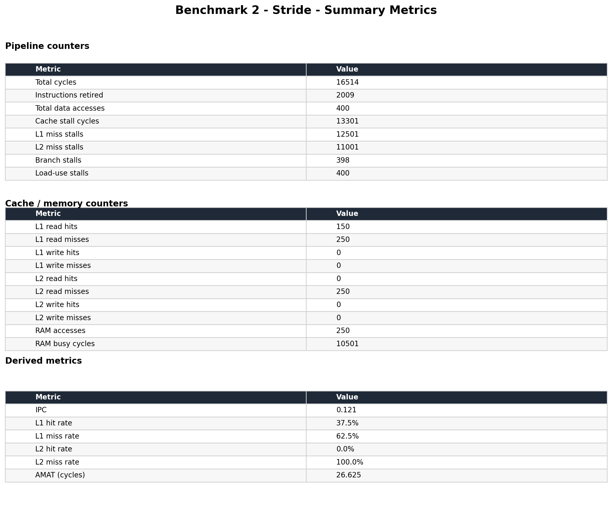

**Hit rate vs time (con caché)**

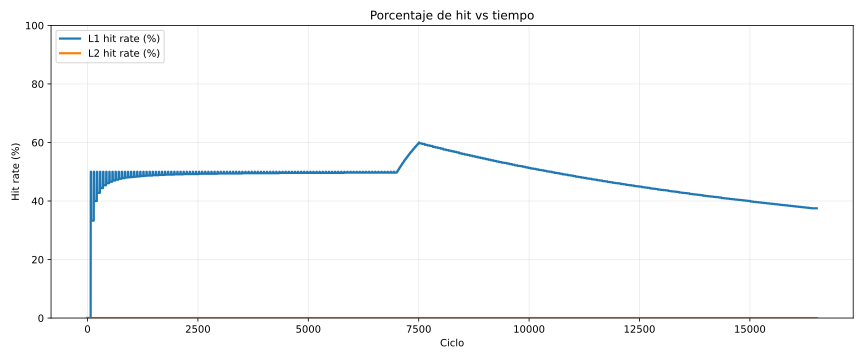

**Tabla resumen (sin caché)**

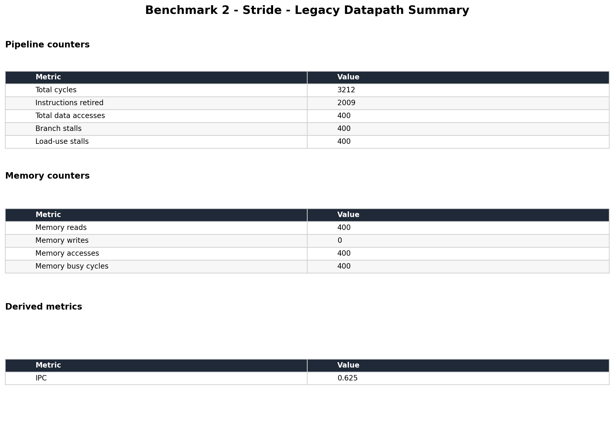

## 3.3.3 Benchmark 3 - Random

Resultados relevantes:

- Con caché: 15232 ciclos, IPC 0.630, 800 accesos en L1, 32 accesos a RAM, L1 hit rate 96.0%, AMAT 2.640 ciclos.
- Sin caché: 12014 ciclos, IPC 0.799, 800 accesos de memoria.

Análisis:

- En este benchmark, la caché muestra un 96% de hits en L1.
- Se reduce la diferencia con no-caché en gran medida respecto a los otros benchmarks.
- Aunque esto ocurra, en el comportamiento sin caché mantiene menos ciclos totales por usar un modelo de memoria mas simple y menos costoso por acceso.

**Tabla resumen (con caché)**

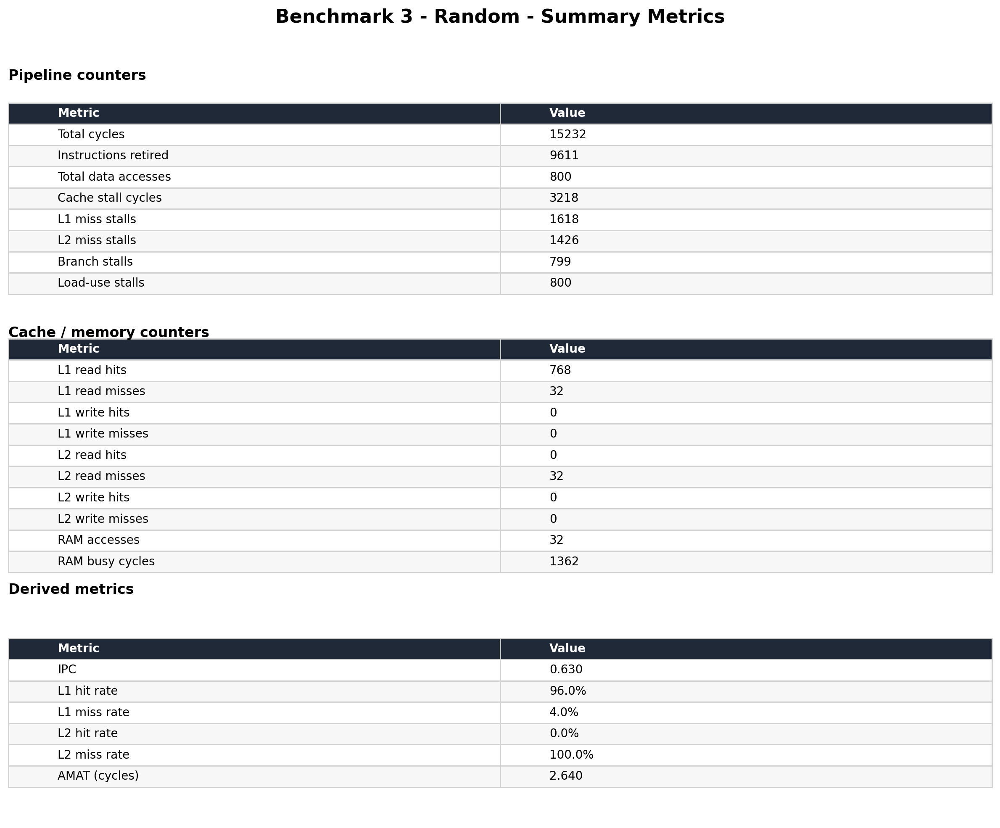

**Hit rate vs time (con caché)**

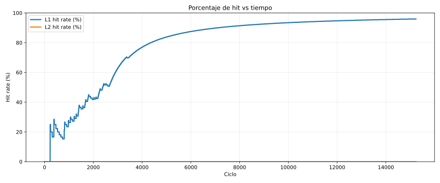

**Tabla resumen (sin caché)**

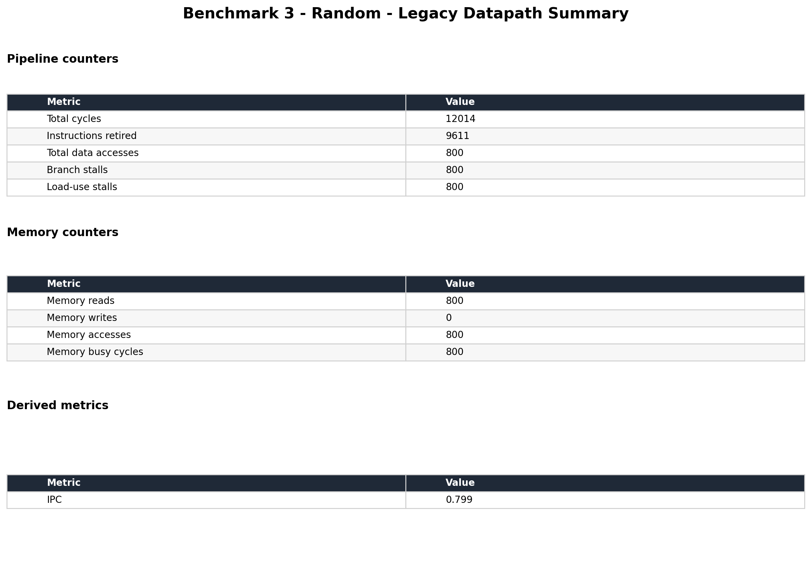

## 3.3.4 Benchmark 4 - Thousands

Resultados relevantes:

- Con caché: 32510 ciclos, IPC 0.307, 2000 accesos en L1, 250 accesos a RAM, L1 hit rate 87.5%, AMAT 6.125 ciclos.
- Sin caché: 16008 ciclos, IPC 0.625, 2000 accesos de memoria.

Análisis:

- Se puede confirmar el comportamiento observado en el benchmark secuencial, pero con carga prolongada.
- La caché con 2000 accesos sigue manteniendo un buen hit rate, pero los misses acumulados siguen impactando mucho por la latencia de memoria principal en la arquitectura con caché.

**Tabla resumen (con caché)**

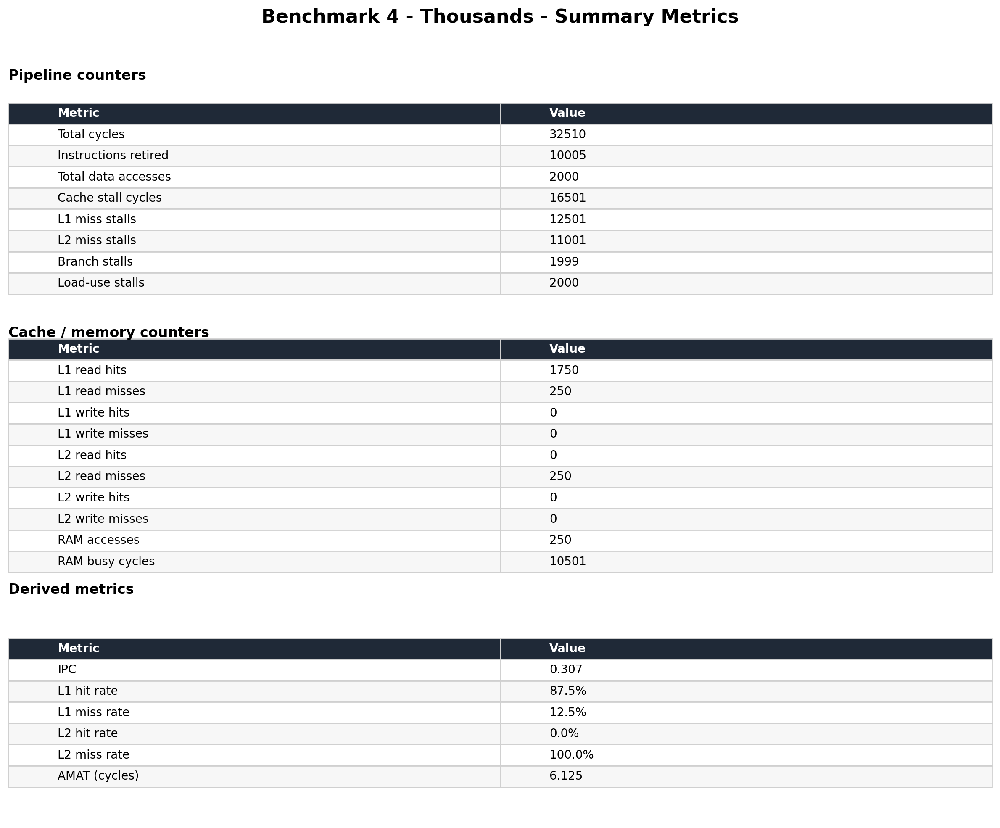

**Hit rate vs time (con caché)**

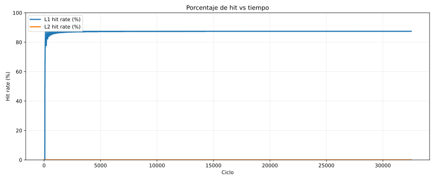

**Tabla resumen (sin caché)**

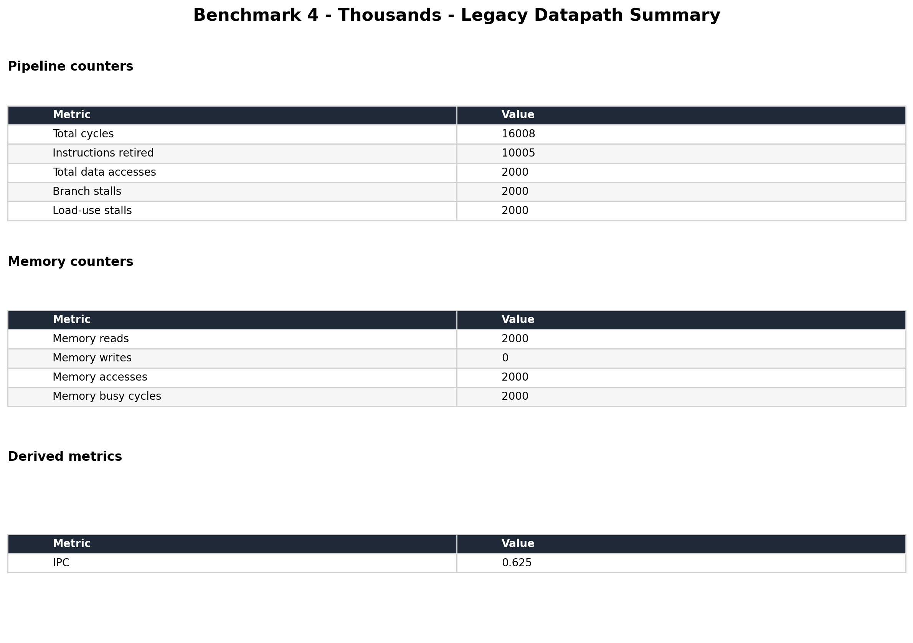

## 3.4 Comparacion global: con caché vs sin caché

### Resumen cuantitativo

| Benchmark | Ciclos no-caché | Ciclos caché | Relacion (no-caché/caché) | Observacion |
|---|---:|---:|---:|---|
| B1 Sequential | 519 | 1048 | 0.495x | caché más lenta |
| B2 Stride | 3212 | 16514 | 0.194x | caché mucho más lenta |
| B3 Random | 12014 | 15232 | 0.789x | diferencia moderada |
| B4 Thousands | 16008 | 32510 | 0.492x | caché más lenta |

- Cuando la relacion no-caché/caché es menor que 1 significa que no-caché termina en menos cantidad de ciclos.
- Con los experimentos realizados, el comportamiento no-caché gana en ciclos en los 4 casos.

### Interpretacion técnica

La comparación no representa solamente caché vs no-caché, sino dos configuraciones de memoria diferentes:

1. Ruta con caché:
   - L1/L2 + memoria principal con latencia alta (usando el modelo realista de memoria).
   - Misses tienen un costo significativo.

2. Ruta sin caché:
   - Memoria de datos directa del datapath legacy (versión original sin caché del proyecto grupal 1), sin jerarquía y con comportamiento más simplificado.
   - Menor costo efectivo por acceso observado en las simulaciones.

Esto permite mostrar que los resultados validan principalmente:

- El impacto de la latencia realista cuando ocurren los misses.
- La sensibilidad de cada benchmark al patrón de acceso.
- El hecho de que una caché no mejora el tiempo total si el costo de miss y la microarquitectura alrededor de la memoria no están balanceados para el workload.

### Gráficas comparativas cache vs no-cache

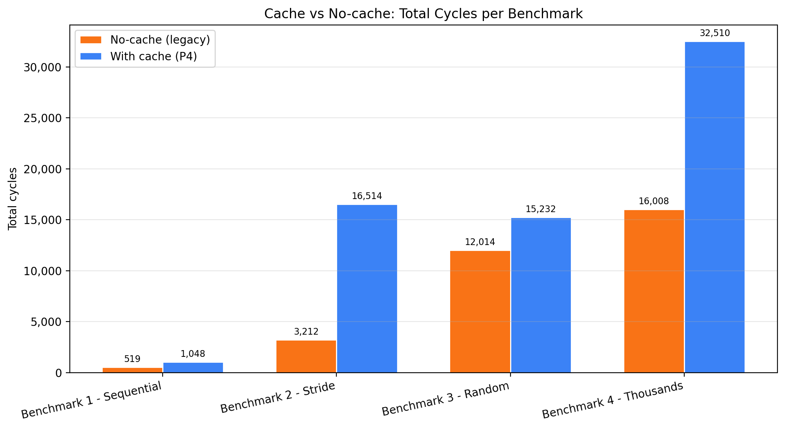

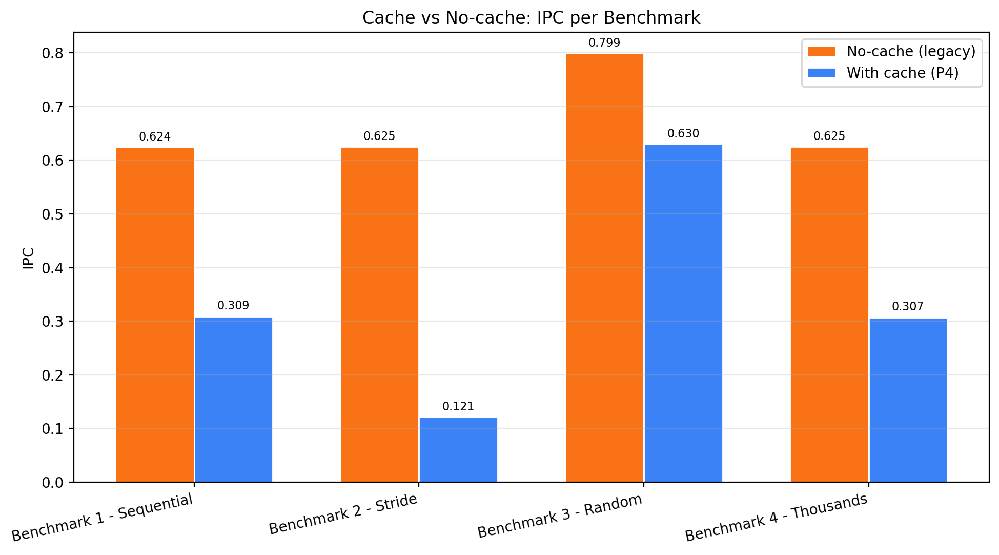

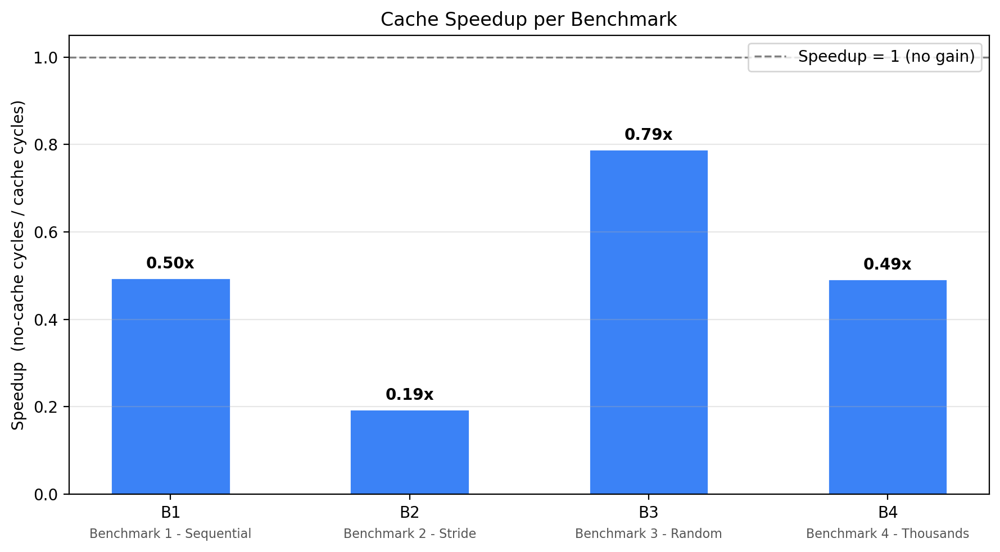

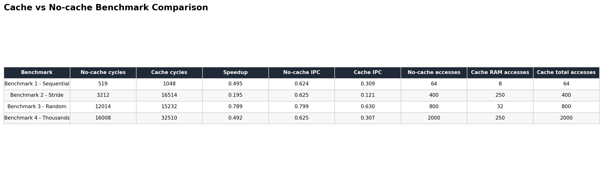

## 3.5 Validación experimental

- Se ejecutó el mismo set de 4 benchmarks en ambas configuraciones (con y sin caché).
- Se obtuvieron las métricas por cada corrida: ciclos, IPC, accesos.
- Los resultados de tablas y gráficas son coherentes entre sí:
  - Los Benchmarks con peor localidad (stride) generaron mayor cantidad de misses y peor AMAT en caché.
  - Los Benchmarks con mejor localidad (random) mejoran el hit rate y reducen el costo.

## 3.6 Conclusiones

1. El comportamiento con caché depende mucho del patrón de acceso y del costo de los misses.
2. En esta implementación, la configuración sin caché es más rapida en ciclos para los 4 benchmarks medidos.
3. El uso de la caché sí demuestra utilidad en la microarquitectura, ya que tiene un alto hit rate en algunos de los casos, pero no compensa completamente la penalización de memoria principal.
4. Para futuras iteraciones, se podría optimizar la ruta de misses (latencia efectiva, política de reemplazo, superposición del trabajo) para capturar mejor los beneficios esperados de la jerarquia de caché.